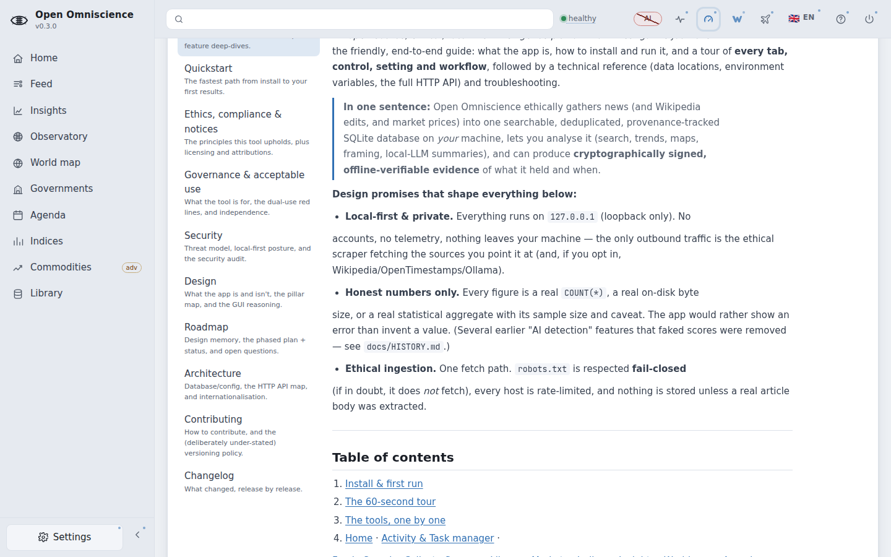
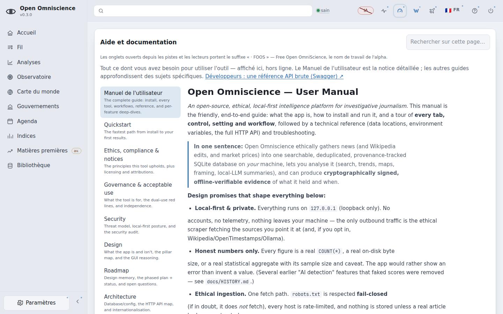
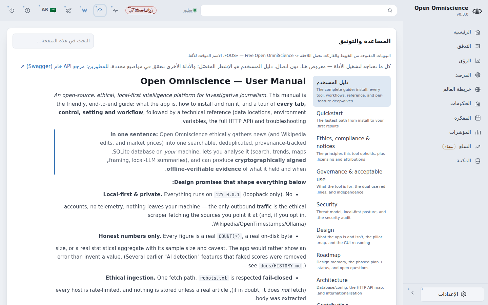
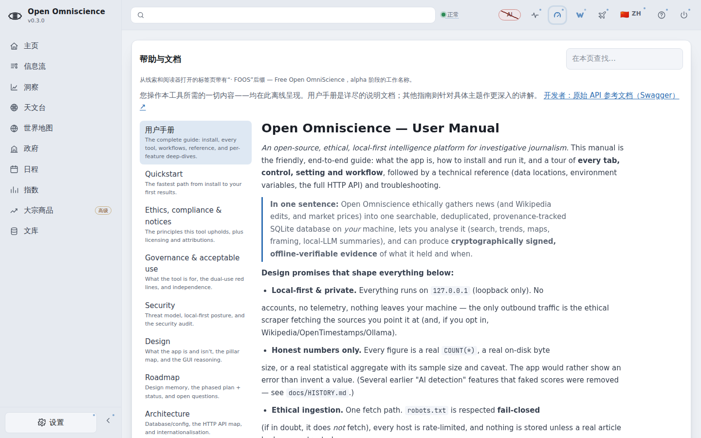
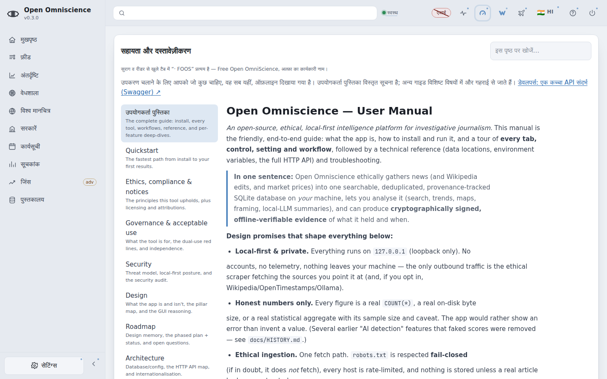

# S04-14 i18n click-through — 2026-09-18

Chromium in the session sandbox, 1440×900, against a seeded 24-article corpus on loopback.
**Zero page errors and zero console errors across all five locales.**

## How it was driven, and why that matters

The language is changed by **clicking the real top-bar switcher** (`#lang-switch`, then the
row in `#lang-menu`), never by calling `OOI18N.setLang` — a scripted state change is not the
control, and a harness that sets the language itself cannot see invariant #15's switcher fail.
The law panel is likewise reached by clicking its `ooSubtabs` button rather than calling
`showGovView`.

## The harness was wrong first, and the run says so

Three of the eight selectors originally resolved to something other than the surface they
named, and the walk reported each as a result:

- `#tab-law p.hint` matched the **first** hint in that tab — the World Bank statistics panel —
  so the law text was never read at all;
- the CSV column block had the same shape;
- `innerText` is **empty for a hidden element**, so three surfaces sitting inside a collapsed
  `
` came back as `""` and read as findings about the app rather than about the probe.

Each selector is now anchored to the panel that owns it, and the read uses `textContent` with
the element's visibility **measured and reported beside the text** (a `[hidden]` prefix) rather
than conflated with it. An empty string and a hidden element are different facts and only one
of them is a finding.

## What the corrected run then caught

1. **The Patterns-lens gate panel froze in the boot locale.** `Corpus size: 24 / 100 000`
   stayed English under `fr` while the pills beside it translated — a render-once panel whose
   composed text nodes the i18n walker can never match. Fixed by splitting the renderer and
   repainting it from the **cached** payload on `oo:langchange`, so a language switch costs no
   request.
2. **`.toLocaleString()` reads the browser locale, which the switcher never touches.** The
   stoplist summary rendered `(2,555)` with an English comma inside a French panel whose sibling
   figure three lines up reads `100 000`. The three sites in code this PR already changed now go
   through `fmtNum`, the ruled app-wide formatter (U+202F grouping, the SI convention); the
   other 60 are recorded in `OPEN_QUEUE.md` as a deliberate omission.

## The run

### `en` — switcher reports `en`, document direction `ltr`

| surface | rendered text (first 160 chars) |
|---|---|
| `collection-hint` | Scraping, source aggregation and crawling run continuously and automatically whenever collection is on and you are online. That covers RSS feeds, recursive craw |
| `speed-value` | Maximum |
| `csv-columns` | Columns: name, domain, rss_url, source_type, country, language, region, tags, priority, rate_limit_ms, enabled, reliability_score. Name and domain are required. |
| `patterns-gate` | Corpus size: 24 / 100 000 not metFalse-positive rate: unmeasured needs a labelled sample judged by a personThe Patterns lens stays off until BOTH numbers are me |
| `bulletin-hint` | A document covering one closed period — what rose in this corpus, which sources carried it, and everything the period could not see. It is built from exact coun |
| `stoplist-summary` | See the built-in stoplist of automatically filtered words (2 555) |
| `law-hint` | Aggregate the law — statutes, gazettes, IP records — from official sources worldwide and track how it changes over time (the data is the diff). A research mirro |
| `help-hint` | Everything you need to operate the tool — rendered here, offline. The User Manual is the detailed notice; the other guides go deeper on specific subjects. For d |

### `fr` — switcher reports `fr`, document direction `ltr`

| surface | rendered text (first 160 chars) |
|---|---|
| `collection-hint` | Le scraping, l'agrégation des sources et l'exploration s'exécutent en continu et automatiquement dès que la collecte est active et que vous êtes en ligne. Cela  |
| `speed-value` | Maximum |
| `csv-columns` | Colonnes : name, domain, rss_url, source_type, country, language, region, tags, priority, rate_limit_ms, enabled, reliability_score. Le nom et le domaine sont r |
| `patterns-gate` | Taille du corpus: 24 / 100 000 non atteintTaux de faux positifs: non mesuré nécessite un échantillon étiqueté jugé par une personneLa loupe des schémas reste dé |
| `bulletin-hint` | Un document couvrant une période close — ce qui a progressé dans ce corpus, quelles sources en ont parlé, et tout ce que cette période n'a pas pu voir. Il est c |
| `stoplist-summary` | Voir la liste d'exclusion intégrée des mots filtrés automatiquement (2 555) |
| `law-hint` | Agréger le droit — lois, journaux officiels, registres de PI — depuis des sources officielles du monde entier, et suivre son évolution dans le temps (les donnée |
| `help-hint` | Tout ce dont vous avez besoin pour utiliser l'outil — affiché ici, hors ligne. Le Manuel de l'utilisateur est la notice détaillée ; les autres guides approfondi |

### `ar` — switcher reports `ar`, document direction `rtl`

| surface | rendered text (first 160 chars) |
|---|---|
| `collection-hint` | الاستخراج وتجميع المصادر والزحف تعمل باستمرار وتلقائيًا كلما كان الجمع مُفعَّلًا وأنت متصل. يشمل ذلك تغذيات RSS، والزحف التكراري، والأسواق، والقوانين، وويكيبيدي |
| `speed-value` | الحد الأقصى |
| `csv-columns` | الأعمدة: name, domain, rss_url, source_type, country, language, region, tags, priority, rate_limit_ms, enabled, reliability_score. الاسم والنطاق مطلوبان. البلد  |
| `patterns-gate` | حجم المتن: 24 / 100 000 غير مُستوفىمعدل الإيجابيات الخاطئة: غير مُقاس يتطلب عيّنة موسومة يحكم عليها شخصتبقى عدسة الأنماط مُعطَّلة حتى يُقاس الرقمان كلاهما ويُست |
| `bulletin-hint` | مستند يغطي فترة واحدة مغلقة — ما ارتفع في هذه المجموعة، وأي المصادر حملته، وكل ما تعذّر على الفترة رؤيته. يُبنى من أعداد دقيقة، فهو السجل لا ملخصًا عنه. لا شيء  |
| `stoplist-summary` | راجع قائمة كلمات الوقف المدمجة للكلمات المُصفّاة تلقائيًا (2 555) |
| `law-hint` | اجمع القانون — التشريعات والجرائد الرسمية وسجلات الملكية الفكرية — من مصادر رسمية حول العالم، وتتبّع كيف يتغيّر عبر الزمن (البيانات هي الفرق). مرآة بحثية، لا ال |
| `help-hint` | كل ما تحتاجه لتشغيل الأداة — معروض هنا، دون اتصال. دليل المستخدم هو الإشعار المفصّل؛ والأدلة الأخرى تتعمّق في مواضيع محددة. للمطورين: مرجع API خام (Swagger) ↗ |

### `zh` — switcher reports `zh`, document direction `ltr`

| surface | rendered text (first 160 chars) |
|---|---|
| `collection-hint` | 抓取、来源聚合与爬取会持续自动运行，只要采集已开启且您处于联网状态。 这涵盖了 RSS 数据源、递归抓取、行情、法律与维基百科——每一个来源。无需安排时间表或编写任何程序；只需打开开关即可。（如果本机内存不足，它会自动暂停，并在之后自行恢复。） |
| `speed-value` | 最大 |
| `csv-columns` | 列： name, domain, rss_url, source_type, country, language, region, tags, priority, rate_limit_ms, enabled, reliability_score. 名称和域名为必填项。国家为 2 字母代码。标签以逗号分隔，因此请为该单 |
| `patterns-gate` | 语料库规模: 24 / 100 000 未达标误报率: 未测量 需要由人工判定的已标注样本在两个数字都经过测量并达标之前，模式透镜保持关闭。未测量的误报率显示为未测量，绝不显示为零。 |
| `bulletin-hint` | 一份涵盖单个已结束周期的文档——记录本语料库中哪些内容有所上升、哪些来源报道了它，以及该周期无法看到的一切。它由精确的计数构建而成，因此它是记录，而非记录的摘要。 此处的一切都不会触碰网络。这份文档在你发布之前，始终只是草稿；而发布也只是为它盖上戳记：署名的是你，而不是机器。 |
| `stoplist-summary` | 查看内置的自动过滤词停用词表 (2 555) |
| `law-hint` | 从全球官方来源归集法律——法规、公报、知识产权记录——并追踪其随时间的变化（这些数据本身就是一份差异记录）。 研究镜像，绝非权威来源，也不构成法律意见： 每条记录都会回链至其官方公报。仅通过合乎伦理、遵守 robots.txt 的路径获取。 参阅用户手册（法律章节）。 |
| `help-hint` | 您操作本工具所需的一切内容——均在此离线呈现。用户手册是详尽的说明文档；其他指南则针对具体主题作更深入的讲解。 开发者：原始 API 参考文档（Swagger）↗ |

### `hi` — switcher reports `hi`, document direction `ltr`

| surface | rendered text (first 160 chars) |
|---|---|
| `collection-hint` | स्क्रैपिंग, स्रोत एकत्रीकरण और क्रॉलिंग निरंतर और स्वचालित रूप से चलते रहते हैं, जब संग्रह चालू हो और आप ऑनलाइन हों। इसमें शामिल हैं RSS फ़ीड, पुनरावर्ती क्रॉल, |
| `speed-value` | अधिकतम |
| `csv-columns` | कॉलम: name, domain, rss_url, source_type, country, language, region, tags, priority, rate_limit_ms, enabled, reliability_score. नाम और डोमेन आवश्यक हैं। देश एक  |
| `patterns-gate` | कॉर्पस का आकार: 24 / 100 000 पूरा नहींमिथ्या-धनात्मक दर: अमापित किसी व्यक्ति द्वारा आँके गए लेबल किए नमूने की आवश्यकता हैजब तक दोनों संख्याएँ मापी और पूरी नहीं  |
| `bulletin-hint` | एक बंद अवधि को कवर करने वाला दस्तावेज़ — इस कॉर्पस में क्या उभरा, किन स्रोतों ने इसे छापा, और वह सब कुछ जिसे वह अवधि नहीं देख सकी। यह सटीक गणनाओं से बना है, इसल |
| `stoplist-summary` | स्वतः फ़िल्टर किए गए शब्दों की अंतर्निहित स्टॉपलिस्ट देखें (2 555) |
| `law-hint` | विधि को एकत्र करें — क़ानून, राजपत्र, आईपी रिकॉर्ड — दुनिया भर के आधिकारिक स्रोतों से, और यह समय के साथ कैसे बदलता है, इसे ट्रैक करें (डेटा ही डिफ़ है)। एक शोध  |
| `help-hint` | उपकरण चलाने के लिए आपको जो कुछ चाहिए, वह सब यहीं, ऑफ़लाइन दिखाया गया है। उपयोगकर्ता पुस्तिका विस्तृत सूचना है; अन्य गाइड विशिष्ट विषयों में और गहराई से जाते हैं |

## Reproducing it

`walk.py` in this directory is the script as run. Point it at a loopback instance:
`python walk.py <port> <output-dir>`.
