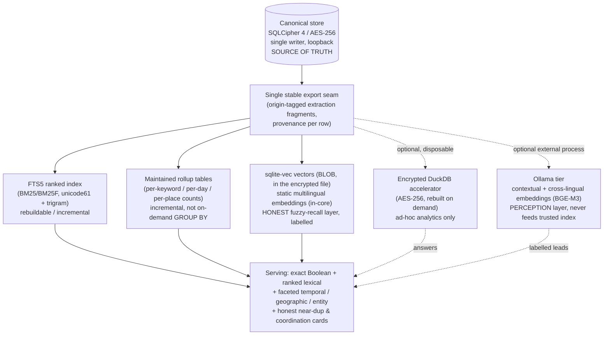

# Serving an Investigative Journalist from a Single Encrypted SQLite File
## A performance-first, perspective-widening research report for Open-Omniscience

Scope: how to make a FOSS, local-first, offline, single-machine keyword search-and-analytics
engine serve an investigative journalist as well as possible, with a hard emphasis on (a)
performance at 10^5 docs / 10^6 keywords and the 10x/100x path, and (b) perspectives the
prior morphological-conflation study did not take. Counts and methods, not scores.

Verification posture. Every load-bearing claim below is tagged [CONFIRMED] (read from a
primary or vendor source during this research), [STD] (a standard, well-established result I
am asserting from the literature without re-fetching the original paper this session), or
[FLAG] (uncertain — verify before you rely on it). Licenses I did not read directly this
session are marked "license: X (verify)". I have invented no benchmark, DOI, endpoint, or
library capability; where I lack a number I say so.

North star, restated. The journalist must find, cross-reference, and verify across many
sources and languages without being misled. That last clause is the design constraint that
decides almost every trade-off here: a recall aid that cannot explain itself is worse than
useless to this user, because a false lead consumes the scarcest resource (their trust and
their time). So the report keeps a hard line between the trusted layer (exact, reversible,
provenance-bearing) and any perception layer (approximate, labelled, disposable).

---

## 0. The one reframe that organizes everything

Your prior durability work already found that the durability skeleton and the scaling skeleton
are the same skeleton: one canonical encrypted SQLite/SQLCipher store with disposable derived
representations off a single stable export seam. The serving problem is that same skeleton a
third time. Almost none of your current pain is a search-engine problem; it is a
derived-state-rebuild problem. FTS5 at 10^5–10^6 documents is comfortably inside its design
envelope on a laptop; what hurts is (1) how you rebuild the index, (2) running whole-corpus
aggregates on demand instead of maintaining them, and (3) carrying junk keywords that inflate
every pass. Fixing the serving engine therefore means fixing the rebuild and the rollups, not
replacing the primitive.

Everything below the seam is disposable, rebuildable, and either encrypted at rest or held in
memory. Nothing below the seam is ever authoritative. That single rule satisfies your
non-negotiables and is also the thing that makes re-index cheap: if a derived store is truly
disposable, you are free to rebuild only the part that changed.

---

## 1. Prioritized roadmap (P1…P9)

Ordered by cost/yield. One sequencing caveat: P5 (the evaluation harness) is placed by
cost/yield but should be stood up first, because it is how you prove every other item actually
helped and catch the regressions conflation will cause.

### P1 — Replace full re-index with origin-tagged fragments + incremental FTS5 maintenance
- What: stop "per-article re-extraction + delete-then-reinsert through one writer". Adopt the
  OCCRP Aleph storage pattern: store every extractor's output as fragments tagged by origin,
  retaining provenance, and merge fragments with the same entity/keyword id at index time
  [CONFIRMED, docs.aleph.occrp.org ingest-pipeline + architecture]. A re-index then re-runs
  only the fragments from the origin that changed (e.g. you upgraded the lemmatizer, or
  re-ran one language's NER) and re-merges, instead of re-extracting the whole corpus. On the
  FTS5 side, use an external-content table over your canonical rows, and use the
  contentless-delete / 'delete' commands + 'deletemerge' rather than dropping and rebuilding
  the whole virtual table [CONFIRMED, sqlite.org/fts5.html]. Batch writes into a few large
  transactions; the writer is single, so make each write big.
- Cost: medium-high (schema for fragments + origin tags; rewrite the rebuild orchestration).
- Expected yield: the headline win. Hours-to-days becomes minutes-to-hours for partial
  re-index; full rebuild becomes rare. No hard public benchmark for your exact corpus exists
  [FLAG], but the mechanism removes the two dominant costs (whole-corpus re-extraction and
  delete-then-reinsert churn through one encrypted writer).
- Unblocks: frequent, safe re-indexing; makes the lemmatization/language fixes (P6) cheap to
  apply repeatedly; makes everything else iterable.
- Fit: yes. Stays in the encrypted store; provenance per fragment is exactly your "merged by
  X" reversibility requirement; no new heavy dependency.

### P2 — Maintain rollups; stop on-demand whole-corpus GROUP-BY
- What: per-keyword analytics that "freeze" are whole-corpus aggregates computed at query time
  over the 2.4M-row mention table. Maintain them instead: incremental counter/rollup tables
  (per keyword, per day, per place, per language) updated at ingest (triggers or a batch step
  in the same writer transaction). For ad-hoc, exploratory analytics that you cannot
  pre-aggregate, stand up a disposable columnar accelerator (P2b).
- P2b: DuckDB as the disposable accelerator. DuckDB is 5x–50x faster than SQLite on
  aggregations/GROUP-BY at scale (vendor-independent comparisons converge on this range; some
  report higher on very large scans) [CONFIRMED, motherduck.com, getorchestra.io, datacamp].
  Two constraint-critical facts: (i) DuckDB's sqlite_scanner reads a plaintext SQLite file, so
  it cannot point at your SQLCipher source directly [CONFIRMED, duckdb.org/docs sqlite]; (ii)
  since DuckDB 1.4.0 LTS (Sept 2025), DuckDB encrypts its own files at rest with AES-256 (GCM
  default; also CBC/CTR) covering the main file, WAL, and temp files, keyed via ATTACH ...
  (ENCRYPTION_KEY '...') [CONFIRMED, duckdb.org/2025/09/16 and /2025/11/19]. So the only
  constraint-clean pattern is: export from SQLCipher in-process and build an encrypted DuckDB
  accelerator (or hold DuckDB in :memory:), never a plaintext side file. Caveat: DuckDB's
  encryption "does not yet meet the official NIST requirements" (tracking canary-tag
  verification, issue #20162) and keeps the file header in plaintext with a salt + encrypted
  canary [CONFIRMED, duckdb.org/2025/11/19] — it is younger and less battle-tested than
  SQLCipher, so treat the DuckDB accelerator as a convenience, not a second source of truth.
- Cost: medium (rollups: low; DuckDB accelerator: medium).
- Expected yield: per-keyword analytics go from "freeze" to instant for maintained rollups;
  5x–50x for the DuckDB path on the ad-hoc aggregates that remain.
- Unblocks: trends, PMI, map, and manipulation-pattern cards at 10x/100x without UI stalls.
- Fit: yes, with the encryption caveat above. PMI and trends still carry method + n; rollups
  do not change the honesty story, they just cache the arithmetic.

### P3 — One SQLCipher + FTS5 tuning pass (cheap, compounding)
- What, SQLCipher: keep one connection open for the session so the PBKDF2-HMAC-SHA512 key
  derivation (default 256,000 iterations in v4) is paid once, not per query — "do not
  repeatedly open and close connections" is the single highest-impact SQLCipher guideline
  [CONFIRMED, zetetic.net/sqlcipher/performance]. Set a large cache_size; under encryption
  this is your main in-memory lever because SQLCipher effectively cannot use SQLite's mmap:
  the pager disables direct/mmap reads when a codec is active (xCodec != 0 forces
  sqlite3PagerDirectReadOk to return 0) [CONFIRMED, sqlcipher/src/pager.c]. Typical encryption
  overhead is 5–15% on many operations; full table scans are roughly plain-SQLite speed once
  pages are decrypted, but the per-page AES + HMAC cost is paid on every cold page
  [CONFIRMED, zetetic.net + sqlcipher GitHub]. Do not lower kdf_iter unless your key is
  already high-entropy (a random key, not a passphrase) — lowering it for a passphrase weakens
  it [CONFIRMED, zetetic.net/sqlcipher/performance]. Threat-model note: decrypted pages live
  as cleartext in the page cache in RAM for the life of the connection; cache_size=0 prevents
  that but destroys performance [CONFIRMED, sqlcipher issue #262]. WAL mode for read/write
  concurrency of the single writer + readers.
- What, FTS5: run 'optimize' after bulk loads to merge the per-transaction b-tree segments
  into one (this is what speeds queries; VACUUM does not do it) [CONFIRMED, sqlite.work +
  sqlite.org/fts5.html]; tune 'automerge'/'crisismerge' (crisismerge default 16; a crisis
  merge can stall a write) to control merge timing under heavy ingest [CONFIRMED,
  sqlite.org/fts5.html]; keep columnsize on (setting it to 0 disables bm25) [CONFIRMED,
  sqlite.org/fts5.html]; add prefix= indexes only where you truly need autocomplete (they
  cost space). Test page_size 4096 (default) vs 8192 for your scan-heavy analytics.
- Cost: low (a tuning sprint + a benchmark harness).
- Expected yield: compounding single-digit-to-low-multiple gains on read latency and ingest;
  the 'optimize' + open-connection changes alone often matter more than people expect.
- Unblocks: makes P1/P2 measurements clean.
- Fit: yes; all in-store, no new dependency.

### P4 — Turn on ranked lexical (BM25/BM25F) + faceted temporal / geographic / entity retrieval
- What: FTS5 already ships bm25() as a built-in auxiliary function (k1=1.2, b=0.75 hard-coded;
  lower score = better match), and per-column weighting via bm25(table, w0, w1, ...) is exactly
  field-weighted BM25F [CONFIRMED, sqlite.org/fts5.html + multiple practitioner sources]. So
  moving from raw Boolean to ranked retrieval is essentially ORDER BY rank — almost free. Then
  add the journalist's real axes as first-class facets: time (publication date ranges) and
  place (your ingest-time geo extraction) and entity (people/orgs as filters), combined with
  the text query. Both OCCRP Aleph and ICIJ Datashare make exactly these the primary filters
  (Datashare filters by file type, language, named entities of type person/org/location, email,
  path, date, combinable with AND/NOT/phrase/wildcard/fuzzy search) [CONFIRMED, icij.org +
  docs.aleph.occrp.org search].
- Cost: low (ranking) to medium (facet UI + indexed facet columns).
- Expected yield: large relevance and navigation improvement for near-zero engine cost; this is
  the cheapest user-visible quality jump available.
- Unblocks: "find" and "cross-reference" along the axes journalists actually use.
- Fit: yes; ranking is explainable (BM25 over tokens you can point at), facets are exact.

### P5 — Evaluation harness (build first; listed here by cost/yield) — see Section 4
- What: a frozen, multilingual gold set + a regression harness using pytrec_eval or ranx; an
  explicit measurement of the recall gain vs precision loss your conflation creates.
- Cost: low-medium (mostly the human effort of judging a few hundred query-doc pairs once).
- Expected yield: this is what converts "I think it's better" into nDCG@10 / MRR / Recall@k
  deltas, and what catches conflation over-merging before it ships.
- Unblocks: confident iteration on P1, P4, P6, P7, P8.
- Fit: yes; entirely local, no telemetry, no user pool needed (Section 4 explains why).

### P6 — Language reconciliation + stale-token flush + segmenter gating (already decided)
- What: you have already decided to (a) flush stale digit/code tokens at re-index, (b)
  reconcile each keyword's stored language from first-write to its true mention-signature
  majority (~16% of keywords, ~40% of the high-traffic English head), and (c) require a
  segmenter for CJK/Thai or not mint keywords there. I am not re-deriving these. I am
  sequencing them here because they also shrink the keyword set, and a smaller index makes
  every pass in P1–P4 faster, and correct language is a prerequisite for correct lemmatization.
- Cost: already scoped by you.
- Expected yield: quality + a not-incidental speed dividend from a smaller index.
- Unblocks: correct simplemma lemmatization and correct CJK/RTL behavior.
- Fit: settled.

### P7 — Honest near-duplicate and coordination detection at scale (MinHash / SimHash)
- What: detect wire-service reprints, syndicated copy, and coordinated copy-paste campaigns by
  near-duplicate clustering. MinHash (Broder, 1997) estimates Jaccard similarity over shingled
  text; SimHash (Charikar, 2002) produces compact 64-bit fingerprints; both combine with
  Locality-Sensitive Hashing (Indyk & Motwani, 1998) banding to avoid O(n^2) comparisons
  [STD; cross-confirmed via RETSim, arXiv 2311.17264, which uses datasketch's MinHashLSH and
  reports common practice of ~10 hash functions]. The standard CPU implementation is the
  Python datasketch library (MinHashLSH) [CONFIRMED, RETSim + practitioner sources; license:
  MIT, verify]. These scale to terabyte corpora on CPU (used to dedup C4 and The Stack)
  [CONFIRMED via RETSim references], so 62k–6.2M articles is trivial.
- Honesty: surface near-dup clusters as a card carrying method + n ("N near-identical texts,
  Jaccard >= t, across M outlets, first seen <date>"), and let the user open the cluster. Do
  not assert "coordination" — assert measured textual overlap and let the journalist judge
  intent. The relevant journalism benchmark is NEWS-COPY (Silcock et al., 2022) for
  reproduced-news detection [STD/FLAG: cited via RETSim; verify the exact venue].
- Cost: medium (shingling + LSH index; a clustering UI).
- Expected yield: high journalistic value; directly serves "verify across many sources" and is
  a strong de-US-centring signal (the same story reprinted globally is visible).
- Unblocks: a manipulation-pattern card that is genuinely novel for an offline tool.
- Fit: yes; pure CPU, no torch/onnx, offline, fingerprints can live in the encrypted store.

### P8 — In-core static multilingual embeddings (model2vec) + sqlite-vec + hybrid RRF
- What: add an honest, clearly-labelled fuzzy-recall / did-you-mean / related-terms /
  cross-lingual-lead layer using static embeddings that run in-core without torch/onnx.
  model2vec's base package depends only on numpy and runs inference as a token-embedding
  lookup plus pooling, up to ~500x faster than the source transformer on CPU [CONFIRMED,
  github.com/MinishLab/model2vec; license: MIT, verify]. potion-multilingual-128M is distilled
  from BAAI/bge-m3, trained on 101 languages, 256-dim, effectively unlimited context because
  embeddings are static [CONFIRMED, huggingface.co/minishlab/potion-multilingual-128M].
  Quality: static models recover roughly 80–92% of a MiniLM-class transformer's MTEB score
  while being orders of magnitude faster [CONFIRMED, model2vec results + Medium write-up; treat
  the exact percentages as indicative]. Store vectors as BLOBs via sqlite-vec, a pure-C,
  zero-dependency SQLite extension (Mozilla Builders-sponsored) that keeps vectors inside the
  (encrypted) SQLite file and does brute-force KNN [CONFIRMED, github.com/asg017/sqlite-vec;
  license: permissive MIT/Apache, verify]. sqlite-vec's own on-disk benchmark: 100k vectors,
  average KNN latency under 75ms for <=768-dim float vectors, 105ms at 1536-dim, 214ms at
  3072-dim, and ~11ms for a binary-quantized 3072-dim vector; "golden target" under 100ms
  [CONFIRMED, alexgarcia.xyz sqlite-vec stable-release post]. Fuse the static-dense ranking
  with the BM25 ranking using Reciprocal Rank Fusion: RRF(d) = sum over rankers of 1/(k +
  rank(d)), k≈60, ~7 lines, no score calibration, no training (Cormack, Clarke, Büttcher,
  SIGIR 2009, pp. 758–759, DOI 10.1145/1571941.1572114) [CONFIRMED, dl.acm.org +
  cormack.uwaterloo.ca PDF].
- Honesty: a static embedding has no context sensitivity — each token's vector is fixed
  regardless of surrounding words — so it captures bag-of-token topical similarity, not
  contextual meaning; it will conflate polysemy and miss negation/word order. Label every
  dense-surfaced result as an approximate neighbour, show why it surfaced (lexical vs
  semantic), and never let it feed the trusted index.
- Cost: medium.
- Expected yield: meaningful recall gain for vocabulary mismatch and "I don't know the exact
  term" queries; cross-lingual leads at low quality but zero extra process.
- Unblocks: "find" when the journalist's words differ from the source's words.
- Fit: yes — this is the headline outside-the-box result. Dense retrieval that is offline,
  CPU-only, multilingual, in the encrypted store, and constraint-clean (no torch/onnx),
  because static embeddings sidestep the heavy-ML prohibition entirely.

### P9 — Optional Ollama-tier contextual + cross-lingual dense (BGE-M3), clearly labelled
- What: when the user opts in, generate contextual embeddings in the already-sanctioned Ollama
  external process (llama.cpp/GGUF, not torch/onnx). BGE-M3 (Chen et al., 2024, arXiv
  2402.03216) is XLM-RoBERTa-based, supports 100+ languages and up to 8192 tokens, does dense,
  sparse, and multi-vector retrieval, and does genuine cross-lingual retrieval (query in French,
  retrieve Arabic/Chinese) [CONFIRMED, arXiv 2402.03216 + ollama.com/library/bge-m3; license:
  MIT, verify]. nomic-embed-text-v2-moe is a fully open-source multilingual MoE alternative
  with Matryoshka dimensions [CONFIRMED, ollama.com]. Ollama exposes POST /api/embed returning
  the vectors plus timing fields [CONFIRMED, morphllm.com ollama-embedding-models]. Store the
  resulting vectors via sqlite-vec exactly as in P8 and fuse with RRF.
- Hard operational caveat: vectors from different embedding models are not comparable, so the
  chosen model becomes a schema commitment; changing it means re-embedding the whole corpus
  [CONFIRMED, morphllm.com]. Pick once, version it.
- Cost: low-medium (you already run Ollama).
- Expected yield: materially better semantic and cross-lingual recall than P8's static layer;
  BGE-M3 outperforms LaBSE on multilingual retrieval [CONFIRMED, MultiMind SemEval-2025, arXiv
  2512.20950].
- Unblocks: high-quality cross-lingual leads for the de-US-centring goal.
- Fit: optional external-process tier only (it is the perception layer, like your local LLM);
  never feeds the trusted index; clearly labelled.

---

## 2. Is a rule-based keyword index the best serving primitive? (Research question 2)

Short answer: keep it as the trusted core and augment it; do not replace it. For a user whose
job is to verify without being misled, the rule-based keyword/entity index is the right
trusted primitive precisely because it is exact, explainable, reversible, auditable,
multilingual, CPU-cheap, and traceable — every hit points at a specific token in a specific
document. The other paradigms are recall aids, not truth primitives. The honest framing is a
two-tier system: a trusted lexical/entity core, and a labelled, disposable recall layer.

Paradigm-by-paradigm, against your constraints (no torch/onnx in core, modest CPU, honest,
reversible, multilingual):

- Lexical ranking (BM25 / BM25F vs raw FTS5). Already available in FTS5 at near-zero cost
  (P4). Best trusted primitive; explainable. Fits fully. [CONFIRMED]
- Honest CPU-only dense embeddings (small multilingual encoders). Feasible in two flavors:
  static in-core (model2vec/potion, numpy-only, P8) and contextual via Ollama (BGE-M3, P9).
  Helps where vocabulary mismatch hurts lexical recall; hallucinates similarity on polysemy
  and negation. Belongs in the labelled recall layer, never the trusted index. Static fits
  core; contextual fits the optional tier. [CONFIRMED]
- Hybrid lexical + dense (RRF). The best recall-quality combination; ~7 lines; no calibration.
  Use it, but always show result provenance (lexical match vs semantic neighbour). Fits.
  [CONFIRMED]
- Learned-sparse retrieval (SPLADE-class). Does not fit. Three independent blockers: (1) the
  official SPLADE weights and training code are released under a Creative Commons
  NonCommercial license, which is incompatible with a license-clean FOSS tool [CONFIRMED,
  en.wikipedia.org Learned sparse retrieval]; (2) generating SPLADE vectors needs a BERT
  forward pass, i.e. transformers/torch, which your core forbids and your hardware (2 cores,
  no GPU) makes slow; (3) standard SPLADE is English/BERT — the multilingual successor SPLARE
  is ~7B-scale and infeasible on your box [CONFIRMED, machinelearningatscale.substack.com]. At
  most an optional-tier experiment with a permissively-licensed SPLADE++ variant, and even
  then the multilingual gap remains. Recommend against.
- Entity/graph-centric indexing (people/orgs/places first-class). Complementary, not a
  replacement. Make entities first-class facets (P4) and offer a "find the connection"
  co-occurrence/graph view. But heed ICIJ's own warning: automatically extracted entity graphs
  are noisier than hand-verified ones; their fact-checked Offshore Leaks graph was reviewed by
  humans, whereas the auto-built Datashare/Neo4j graph is "a precious pool" for discovery, not
  ground truth [CONFIRMED, icij.org Neo4j plug-in article]. So: entity graph as a labelled
  discovery aid with provenance, never as asserted fact.

Verdict for the constraints: trusted lexical + entity core (exact, reversible), plus a
labelled hybrid recall layer (static dense in core, contextual/cross-lingual dense in the
Ollama tier), plus near-dup/coordination as an honest signal. SPLADE out; dense never
authoritative; graph only as discovery.

---

## 3. Peer practice in investigative journalism — what transfers (Research question 3)

The newsroom tools are server stacks (Elasticsearch + Postgres + Redis + queues). The
infrastructure does not transfer to a single encrypted SQLite file; the patterns do.

- OCCRP Aleph / OpenAleph. Core ideas worth stealing: (1) FollowTheMoney (FtM), one schema
  where both uploaded files and structured records become entities [CONFIRMED]; (2) fragments
  stored by origin with provenance, merged at index time, "flushed or updated granularly by
  origin" — this is the exact mechanism behind P1 and directly attacks your re-index pain
  [CONFIRMED, docs.aleph.occrp.org ingest-pipeline]; (3) Mention entities for each extracted
  person/company to make cross-referencing queries simple [CONFIRMED, entity-extraction];
  (4) a hybrid index mapping that supports both full-text search and exact-match structured
  filters (keyword type for emails/dates/IDs, text type for prose) — replicate with FTS5 for
  text + indexed columns for facets [CONFIRMED, docs.aleph.occrp.org search]; (5) cross-ref
  ("xref") to compare entities across datasets [CONFIRMED]. NER is spaCy plus regex patterns
  for phone/email/IBAN; spaCy's default (non-transformer) pipelines run on CPU without torch,
  a useful reference for your ingest-time extraction. OpenAleph is MIT and can run air-gapped
  [CONFIRMED, openaleph.org].
- ICIJ Datashare. The closest local-first analog: self-hosted, runs on one personal computer,
  used offline, AGPL-3.0 [CONFIRMED, github.com/ICIJ/datashare]. It is, by its maintainers'
  own description, a friendly interface over an index, with pluggable NER (CoreNLP / OpenNLP /
  IXA-pipe / MITIE, plus a spaCy plugin) and faceted filters (type, language, person/org/
  location, email, path, date) combinable with AND/NOT/phrase/wildcard/fuzzy search
  [CONFIRMED, icij.org + GitHub]. Transferable: the faceting model (P4), the pluggable-extractor
  model (your origin-tagged fragments), the explicit multilingual NER-per-language design, and
  the Neo4j "connect the dots" plugin with its honesty caveat (P2 of RQ2 above). Note the
  multilingual gap to learn from: Datashare's bundled NER historically covered only a handful
  of European languages well — a reminder that for your 12 languages incl. CJK + RTL, extraction
  quality is per-language and must be evaluated per-language (Section 4).
- DocumentCloud (MuckRock). Primarily a hosted platform (OCR, structured/entity search,
  add-ons). Useful as a reference for document-centric workflows and annotations, but least
  transferable to single-machine offline; I did not re-fetch its current architecture this
  session [FLAG], so I make no specific technical claim about it here.

License-clean patterns you can adopt without a cluster: FtM-style unified entity schema;
origin-tagged provenance fragments with serve-time merge; mention rows for cross-reference;
hybrid text+facet index; entity co-occurrence/graph as labelled discovery; per-language
extraction with per-language evaluation. None of these require Elasticsearch.

---

## 4. Evaluation with no user pool (Research question 4)

You do not need a user pool. You need a frozen gold set and a regression harness, plus the
knowledge that relative comparisons are robust even when a single assessor's judgments are
imperfect.

- Build a small gold set by pooling. You cannot judge every document, so do what TREC does:
  pool the top-k results from several of your own system variants (BM25, BM25+facets, hybrid),
  then judge only the pooled documents for each query [STD; Zobel 1998 on pooling reliability;
  Voorhees 2000 on judgment stability, via Stanford IR book chapter 8]. Aim for tens to a low
  hundred queries spread across your 12 languages and across your real axes (a known-item
  query, a topic query, a cross-lingual query, a near-dup query). Use graded relevance (e.g.
  0/1/2), not binary, so nDCG can reward putting the most relevant first.
- Metrics. nDCG@10 (graded relevance with a log rank discount; the default for retrieval and
  on MTEB), MRR@10 (reciprocal rank of the first relevant; good for known-item / navigational
  queries), Recall@k (did the relevant doc survive into the candidate pool at all — the metric
  that matters most for "don't miss the story"), and Precision@k [STD; weaviate.io, arXiv
  2510.21440]. Report each as an average over queries with n stated.
- Tools, all offline and permissive: trec_eval (the NIST standard); pytrec_eval, a fast Python
  interface to it (RelevanceEvaluator over a qrel dict + a run dict; supports ndcg_cut.k, P.k)
  [CONFIRMED, arXiv 1805.01597]; or ranx, a NumPy/Numba library that adds MRR, runs faster, and
  does statistical significance testing between runs out of the box (and implements RRF fusion
  too) [CONFIRMED, ceur-ws.org Vol-3177 paper23 + practitioner sources; ranx attributed to
  Bassani, ECIR 2022 — FLAG, verify the citation]. All three give the same metric values on the
  same inputs.
- Why a single assessor is enough for comparisons. Voorhees' classic finding is that while
  different assessors disagree on individual judgments, the relative ranking of systems stays
  stable [STD]. So even your own idiosyncratic judgments yield trustworthy answers to "did
  variant B beat variant A", which is exactly the question a regression harness asks.
- The conflation trade-off, measured explicitly. Conflation (your morphological families,
  cross-language rings, super-groups) raises recall and can lower precision. Do not summarize
  this as one number. For each conflation rule, report the recall gained and the precision lost
  on the gold set, plus n examples of newly-merged-correct vs newly-merged-wrong. This keeps
  your "no composite trust score" rule intact and turns every merge into an auditable decision.
- CJK / RTL honesty. Evaluate per-language, never pooled into one average, because tokenization
  differs fundamentally: CJK has no whitespace word boundaries (segmenter quality dominates),
  and Arabic is RTL with rich morphology and orthographic variants. Two concrete checks:
  (1) for CJK, hold a small segmented gold set and measure whether your segmenter's token
  boundaries match human boundaries before you even measure retrieval; (2) for Arabic, test
  unicode61 with remove_diacritics and a separate trigram-tokenizer FTS for substring matching,
  and judge whether diacritic/orthographic variants are correctly conflated. The cross-lingual
  evaluation collection NeuCLIRBench (arXiv 2511.14758) is a useful design reference for how
  cross-language judgment pools are built (nDCG@20, pools of >=20 docs/run) [CONFIRMED].
- Query-log-free A/B. Run two system variants over the gold set and compare metrics (offline
  A/B). For finer signal without logs, do blind pairwise judging: for a query, show the two
  rankings side by side with sources hidden and record which you prefer; aggregate preferences.
  ranx's significance testing tells you whether a delta is real or noise.

Regression harness: freeze the gold set, run nDCG@10 / MRR@10 / Recall@k on every index or
conflation change, fail the build on a regression beyond a set threshold, and store the
per-language breakdown. This is the cheap discipline that lets you move fast on P1–P8.

---

## 5. Outside-the-box, evidence-backed techniques (Research question 5)

- Corpus-driven query expansion and did-you-mean. Two honest, offline mechanisms: (1) lexical
  expansion from your own index — suggest morphological family members, cross-language ring
  members, and high-PMI co-occurring terms as optional query expansions the user can accept or
  reject (never silently applied); (2) static-embedding nearest neighbours (P8) as
  related-term suggestions. Both are reversible and labelled. Did-you-mean for misspellings can
  use trigram-tokenizer FTS similarity over your own vocabulary, no model needed.
- Temporal + geographic faceted retrieval as primary axes. A journalist's real query is rarely
  just "term"; it is "term, here, in this window". Make time and place co-equal filters with
  the text query (P4), and expose a "burst" view (term frequency over time from your maintained
  rollups) and a map view from your geo extraction. This is also your strongest de-US-centring
  lever: facet by source country and language so the default view is not Anglophone.
- Passage / section retrieval vs whole-document. For long articles, index and rank at the
  passage/section level as well as the document level, then aggregate. This sharpens both
  lexical ranking (BM25 over a focused passage beats BM25 over a long mixed document) and dense
  recall (a static or contextual vector over a 200-word passage is far more faithful than one
  over a 3000-word article). Passage-level units are also the right granularity for near-dup
  detection (P7), since reprinted copy is often partial. Cost: more rows; mitigate with the
  fragment model (P1) and binary-quantized vectors (P8).
- Near-duplicate and coordination detection at scale (P7). Already in the roadmap; it is the
  technique most under-used by offline tools and most aligned with "verify across many
  sources".
- Cross-lingual retrieval, done honestly. Use BGE-M3 (P9) for genuine query-in-one-language /
  hit-in-another recall, or potion-multilingual (P8) for a cheaper in-core version. Present
  cross-lingual hits as leads with the source language shown, and pair them with a machine
  translation only via the labelled perception tier — never assert that two articles "say the
  same thing", only that they are topical neighbours across languages with measured similarity.
- Genuinely novel for a paranoid offline tool: a "provenance-first result card". For every
  surfaced item, render why it surfaced as structured provenance — exact tokens matched (lexical),
  facets satisfied (time/place/entity), and, if applicable, "semantic neighbour (model X,
  cosine c)" or "near-duplicate of N others (Jaccard j)". This makes the honesty machinery a
  feature, not a footnote, and is something the server-stack newsroom tools do not do well. It
  costs almost nothing once P1's provenance fragments exist, and it is the single most direct
  defense against the user being misled.

---

## 6. Master comparison table

Footprint: S = pure code/extension, negligible RAM; M = tens-to-hundreds of MB and/or moderate
RAM; L = large model or server cluster. Offline = runs fully local with no network.

| Technique | Category | Languages | License | Offline? | Footprint | Notes |
|---|---|---|---|---|---|---|
| FTS5 Boolean MATCH | lexical (trusted) | all incl. CJK*/RTL | public domain (SQLite) | yes | S | * CJK needs a segmenter or trigram tokenizer; already your baseline [CONFIRMED] |
| FTS5 BM25 / BM25F | lexical ranking (trusted) | all | public domain | yes | S | bm25() built in; per-column weights = BM25F; near-free upgrade [CONFIRMED] |
| FTS5 external-content + contentless-delete | index storage | all | public domain | yes | S | enables incremental update vs delete-then-reinsert [CONFIRMED] |
| FTS5 trigram tokenizer | substring / CJK / Arabic | all | public domain | yes | S | second FTS for substring + diacritic-tolerant match [CONFIRMED] |
| Maintained rollup tables | analytics | n/a | your code | yes | S | replaces whole-corpus GROUP BY; instant per-keyword stats |
| DuckDB (encrypted, disposable) | columnar analytics accel | n/a | MIT | yes | M | 5x–50x on GROUP BY; AES-256 since 1.4; NOT NIST-validated yet; header plaintext; cannot read SQLCipher directly [CONFIRMED] |
| sqlite-vec | vector store + brute-force KNN | n/a | MIT/Apache (verify) | yes | S | vectors as BLOB in the encrypted file; <75ms/100k @<=768-dim; no ANN yet [CONFIRMED] |
| model2vec / potion-multilingual-128M | static dense (in-core) | 101 | MIT (verify) | yes | S–M | numpy-only inference, no torch/onnx; ~80–92% of MiniLM MTEB; 256-dim; static = no context [CONFIRMED] |
| BGE-M3 via Ollama | contextual + cross-lingual dense | 100+ | MIT (verify) | yes (Ollama) | M–L | dense+sparse+multi-vector; 8192 ctx; GGUF not torch; re-embed if model changes [CONFIRMED] |
| nomic-embed-text-v2-moe via Ollama | contextual dense | ~100 | Apache-2.0 (verify) | yes (Ollama) | M | fully open weights/code/data; Matryoshka dims [CONFIRMED] |
| RRF fusion | hybrid combination | n/a | n/a (algorithm) | yes | S | sum 1/(k+rank), k≈60; no calibration; ~7 lines; Cormack et al. SIGIR 2009 [CONFIRMED] |
| SPLADE / learned-sparse | learned sparse | English (std) | CC-NonCommercial (official) | yes | L | DOES NOT FIT: NC license + torch + multilingual gap [CONFIRMED] |
| spaCy NER (non-transformer) | entity extraction | many (per-model) | MIT | yes | M | CPU, no torch for default pipelines; reference for ingest NER |
| OpenTapioca -> Wikidata QIDs | entity linking | multi | open (verify) | yes | M | your decided entity-linking layer; not re-litigated |
| simplemma + Wikidata Lexemes (CC0) | lemmatization (display) | many | MIT / CC0 | yes | S | your decided conflation stack; not re-litigated |
| MinHash + LSH (datasketch) | near-dup / coordination | language-agnostic | MIT (verify) | yes | S–M | Jaccard over shingles; scales to TB on CPU; honest n-bearing card [CONFIRMED via RETSim] |
| SimHash | near-dup fingerprint | language-agnostic | algorithm | yes | S | 64-bit fingerprints; lighter alternative to MinHash [STD] |
| Entity co-occurrence / graph view | graph-centric discovery | all | your code | yes | S–M | labelled discovery only; auto-graphs are noisy (ICIJ) [CONFIRMED] |
| Passage/section indexing | retrieval granularity | all | your code | yes | S | sharper BM25 + dense; right unit for near-dup |
| pytrec_eval / ranx | evaluation | n/a | MIT (verify) | yes | S | nDCG/MRR/MAP/Recall; ranx adds significance tests [CONFIRMED] |
| Elasticsearch/OpenSearch newsroom stack | server search | many | Elastic/SSPL/Apache | needs server | L | patterns transfer, infrastructure does not |

---

## 7. What does NOT fit, and why

- SPLADE and learned-sparse retrieval: official weights are CC-NonCommercial (license-dirty for
  you), generation needs torch (forbidden in core), multilingual variants are LLM-scale (your
  hardware can't). [CONFIRMED]
- Any GPU/torch/onnx dense retrieval in the core: excluded by your non-negotiables; the only
  constraint-clean dense options are static-in-core (model2vec) and GGUF-via-Ollama (the
  perception tier). [CONFIRMED]
- DuckDB pointed at the SQLCipher source: its sqlite_scanner reads plaintext only; the
  constraint-clean path is an encrypted DuckDB accelerator or an in-memory DuckDB rebuilt from
  the export seam, never a plaintext side file. And DuckDB encryption is not yet NIST-validated,
  so it is a convenience, not a second source of truth. [CONFIRMED]
- mmap as a SQLCipher speed-up: effectively unavailable, because the pager disables direct/mmap
  reads when a codec is active; rely on cache_size instead. Plans that assume mmap under
  encryption are wrong. [CONFIRMED]
- Lowering kdf_iter to speed startup with a passphrase key: weakens security; only acceptable
  with an already-high-entropy random key. [CONFIRMED]
- Treating dense similarity (static or contextual) as truth: static embeddings are
  context-free and contextual ones still hallucinate similarity (polysemy, negation); both
  belong in the labelled recall layer only. [CONFIRMED for static; STD for contextual]
- sqlite-vec brute-force at 100x scale: fine to a few hundred thousand vectors (<100ms at
  <=768-dim); at ~6.2M document-level vectors you will exceed the latency budget and must move
  to passage-level + binary quantization (two-stage: Hamming shortlist then cosine rerank
  recovers ~95% accuracy) or wait for sqlite-vec's planned ANN index. Plan for this before the
  100x step. [CONFIRMED, alexgarcia.xyz + sitepoint]
- Auto-extracted entity graphs presented as fact: ICIJ themselves flag these as noisier than
  hand-verified graphs; ship them as labelled discovery only. [CONFIRMED]
- A composite trust/quality score for conflation or results: against your honesty rule, and
  unnecessary — report recall gain and precision loss separately with n, per Section 4.

---

## 8. Evidence ledger (strongest source per major claim)

- FTS5 bm25() built-in, k1=1.2/b=0.75, per-column weights (BM25F), external-content,
  contentless-delete + deletemerge, automerge/crisismerge (default 16), columnsize disables
  bm25, optimize merges segments: sqlite.org/fts5.html [CONFIRMED]; segment/b-tree merge
  mechanics also at darksi.de/13.sqlite-fts5-structure.
- VACUUM does not optimize FTS5; optimize does: sqlite.work optimizing-fts5-external-content
  [CONFIRMED].
- SQLCipher 5–15% overhead, KDF default 256,000 (PBKDF2-HMAC-SHA512), don't reopen connections,
  per-page HMAC, kdf_iter caveat: zetetic.net/sqlcipher/performance and sqlcipher GitHub
  [CONFIRMED]. mmap disabled under codec: sqlcipher/src/pager.c (sqlite3PagerDirectReadOk)
  [CONFIRMED]. Decrypted pages in cache: sqlcipher issue #262 [CONFIRMED].
- DuckDB 5x–50x on aggregations: motherduck.com, getorchestra.io, datacamp [CONFIRMED].
  sqlite_scanner reads plaintext SQLite: duckdb.org/docs sqlite [CONFIRMED]. DuckDB 1.4.0
  AES-256 encryption (GCM/CBC/CTR, main+WAL+temp, mbedtls/OpenSSL, not NIST-validated, header
  plaintext): duckdb.org/2025/09/16 and /2025/11/19 [CONFIRMED].
- sqlite-vec: pure-C, Mozilla-sponsored, brute-force KNN, on-disk latency numbers, binary
  quantization 2-stage rerank ~95%: github.com/asg017/sqlite-vec, alexgarcia.xyz stable-release
  post, sitepoint local-first RAG [CONFIRMED].
- model2vec numpy-only inference, ~500x CPU speedup, ~80–92% MiniLM MTEB; potion-multilingual
  128M from bge-m3, 101 langs, 256-dim, static: github.com/MinishLab/model2vec,
  huggingface.co/minishlab/potion-multilingual-128M, Medium write-up [CONFIRMED].
- BGE-M3 100+ langs, dense/sparse/multi-vector, 8192 ctx, cross-lingual: arXiv 2402.03216,
  ollama.com/library/bge-m3 [CONFIRMED]; BGE-M3 > LaBSE multilingual: arXiv 2512.20950
  [CONFIRMED]. Vectors not comparable across models / Ollama /api/embed: morphllm.com
  [CONFIRMED].
- RRF: Cormack, Clarke, Büttcher, SIGIR 2009, pp. 758–759, DOI 10.1145/1571941.1572114; k≈60;
  default in Elasticsearch/OpenSearch/Weaviate/Qdrant: dl.acm.org + cormack.uwaterloo.ca PDF +
  bigdataboutique.com [CONFIRMED].
- SPLADE CC-NonCommercial weights, torch, multilingual gap: en.wikipedia.org Learned sparse
  retrieval, github.com/naver/splade, arXiv 2109.10086, machinelearningatscale.substack.com
  [CONFIRMED].
- MinHash (Broder 1997), SimHash (Charikar 2002), LSH (Indyk & Motwani 1998), datasketch
  MinHashLSH, ~10 hash functions, TB-scale dedup: RETSim arXiv 2311.17264 (cites these) +
  practitioner sources [STD via RETSim; verify primary papers if you cite them formally].
- Aleph FtM, fragments-by-origin with provenance + serve-time merge, Mention entities, hybrid
  keyword/text mapping, spaCy + pattern NER: docs.aleph.occrp.org (architecture,
  ingest-pipeline, entity-extraction, search); OpenAleph MIT + offline: openaleph.org
  [CONFIRMED].
- Datashare AGPL-3.0, single-PC/offline, Tika/Tesseract/CoreNLP/OpenNLP/MITIE/spaCy, faceted
  filters, AND/NOT/phrase/wildcard/fuzzy, Neo4j plugin "noisier" auto-graph caveat:
  github.com/ICIJ/datashare, icij.org [CONFIRMED].
- IR evaluation metrics (nDCG/MRR/MAP/P@k/R@k), pooling (Zobel 1998), judgment stability
  (Voorhees 2000): nlp.stanford.edu IR-book ch.8, weaviate.io, arXiv 2510.21440 [STD].
  pytrec_eval: arXiv 1805.01597 [CONFIRMED]. ranx fast + significance tests + fusion:
  ceur-ws.org Vol-3177 [CONFIRMED]; ranx citation Bassani ECIR 2022 [FLAG].
- NeuCLIRBench cross-language eval design (nDCG@20, pools >=20/run): arXiv 2511.14758
  [CONFIRMED].

License flags to verify before shipping (I did not read each license file this session):
model2vec/potion (MIT), sqlite-vec (MIT/Apache), BGE-M3 (MIT), nomic-embed-v2-moe (Apache-2.0),
LaBSE (Apache-2.0), datasketch (MIT), spaCy (MIT), pytrec_eval (MIT), ranx (MIT), OpenTapioca,
Wikidata Lexemes (CC0, decided). Datashare is AGPL-3.0 [CONFIRMED] — if you ever reuse its code
(not just its patterns), AGPL's network-copyleft is a separate decision. SPLADE official weights
are CC-NonCommercial [CONFIRMED] — do not bundle them.

---

## If you do only three things

Fix the rebuild, not the engine: adopt origin-tagged extraction fragments with provenance and
incremental FTS5 maintenance (P1), and maintain rollup tables so per-keyword analytics stop
running whole-corpus GROUP-BYs (P2) — together these turn hours-to-days into minutes and end the
analytics freeze, and they cost you no new heavy dependency and no honesty compromise. Second,
take the free relevance and navigation win: switch FTS5 to BM25/BM25F ranking and add temporal,
geographic, and entity facets as co-equal axes (P4), because that is the cheapest large
improvement to the journalist's actual find-and-cross-reference workflow and it stays fully
explainable. Third, add a single honest recall layer: in-core static multilingual embeddings
(model2vec/potion) stored in sqlite-vec inside the encrypted file, fused with BM25 via
reciprocal rank fusion and rendered with provenance on every result (P8) — this gives genuine
offline, CPU-only, multilingual semantic and cross-lingual recall without torch, while a
provenance-first result card keeps the whole system from ever misleading the one user it serves.
Stand up the gold-set regression harness (P5) alongside all three so every change is proven, not
assumed.
